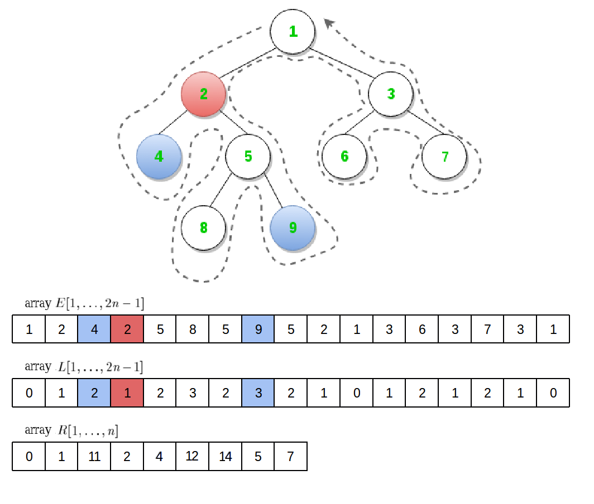
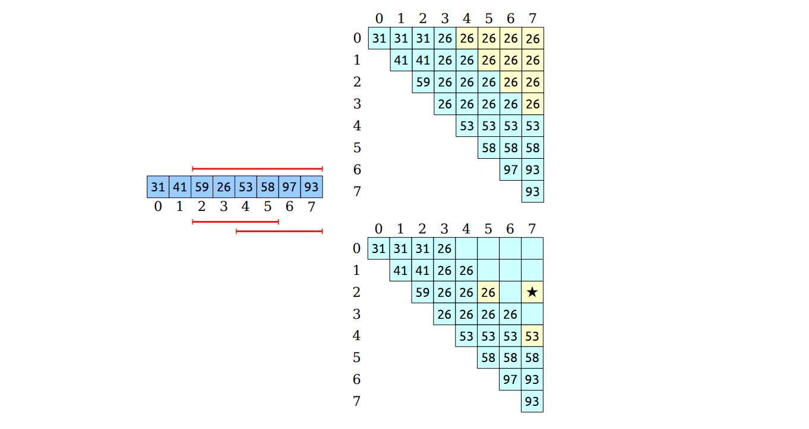
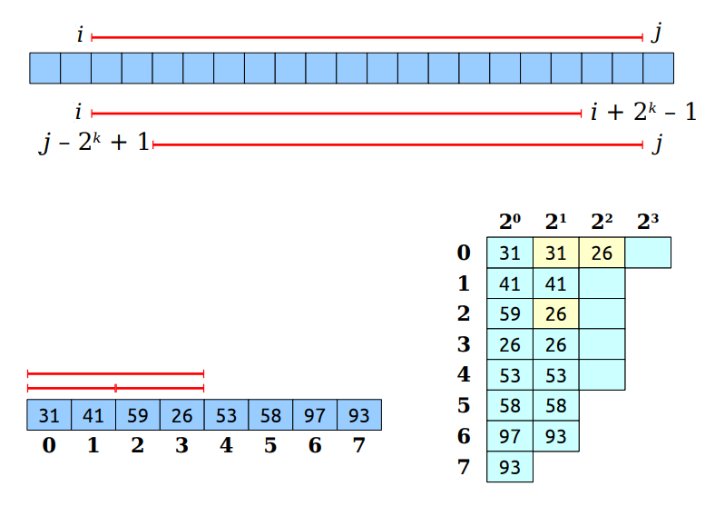
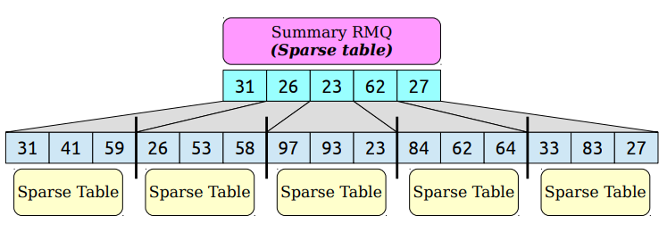
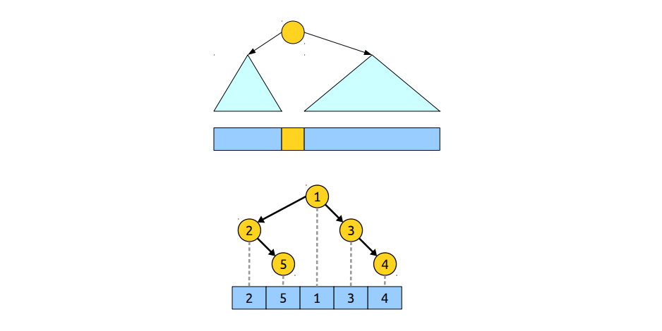
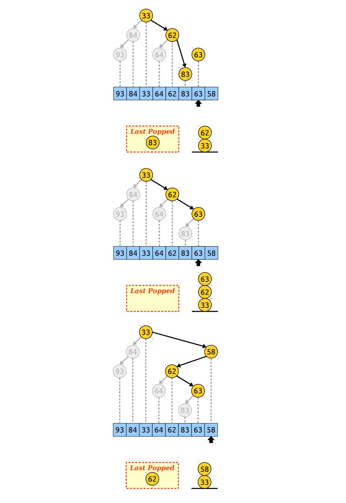
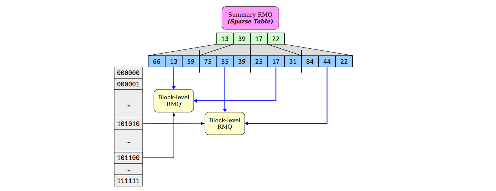

# Correctness and Complexity

## INTRODUCTION ##
A fundamental algorithmic problem on trees is how to find the Least Common Ancestor (LCA) of a pair of nodes. The LCA of nodes <i>u</i> and <i>v</i> in a tree is the shared ancestor of <i>u</i> and <i>v</i> that is located farthest from the root.  

Given a rooted tree <i>T = (V, p, r)</i>  
<i>LCAT(u, v) = w</i>  
where <i>w &isin; { p(k)(u) | k &isin; &#8469; } &cap; { p(k)(v) | k &isin; &#8469; }</i>, and <i>w</i> has maximum depth from the root  

<i>T</i> can be preprocessed in time <i>O(n)</i> (where <i>n</i> is the number of nodes), to answer <i>LCA</i> queries in time <i>O(1)</i>.  
If an algorithm has preprocessing time <i>f(n)</i> and query time <i>g(n)</i>, we will say that the algorithm has complexity <i>\<f(n), g(n)\></i>. Thus, the solution to the <i>LCA</i> problem has complexity <i>\<O(n), O(1)\></i>.  
 The algorithm presented here is from the paper <i>"The LCA Problem Revisited"</i> by <i>Michael Bender</i> and <i>Martin Farach-Colton</i> from the year 2000.  

This solution to the <i>LCA</i> problem relies heavily on the solution to the <i>RMQ</i> problem.  
The <i>Range Minimum Query</i> (RMQ) problem is the following:  
<i>Given an array A and two indecies i and j (i &le; j), what is the index of the smallest element out of A[i...j]?</i>  
<i>RMQA(i, j) = k &harr; A[k] = min A[i...j]</i>  

The <i>LCA</i> problem can be reduced in <i>O(n)</i> time to a special case of the <i>RMQ</i> problem called the <i>&plusmn;1 RMQ</i>.  
We will show that the solution to the <i>&plusmn;1 RMQ</i> problem has complexity <i>\<O(n), O(1)\></i>.  
Finally, the general <i>RMQ</i> problem can be solved in <i>\<O(n), O(1)\></i> by reducing it to the <i>LCA</i> problem in <i>O(n)</i> time.  

<!-- insert pic -->

## REDUCTION OF <i>LCA</i> TO <i>RMQ</i> IN <i>O(n)</i> TIME ##
The <i>LCA</i> problem can be reduced to the <i>RMQ</i> problem by traversing the tree in an <i>Euler Tour</i>.  

Let <i>E[1...(2n-1)]</i> store the nodes visited in the Euler Tour.  
Let <i>L[1...(2n-1)]</i> store the levels of the nodes visited in the Euler Tour. The level of a node is its distance from the root. <i>L[i]</i> is the level of node <i>E[i]</i>.  
Let <i>R[1...n]</i> store the first occurance of every node in the Euler Tour. <i>R[i] = argminj (E[j] = i)</i>  

Let <i>u, v &isin; V</i> and let <i>iu = R[u] < iv = R[v]</i>  
Let <i>k = RMQL(iu, iv)</i>  
Then <i>LCA(u, v) = E[k]</i>  
To see why this is the case consider the node <i>w = E[k]</i>.  
  * If this is the first visit to node <i>w</i>, then there must be a node <i>w'</i> from which we descended to visit <i>w</i> for the first time. This means that <i>L[R[w']] < L[k]</i> - contradiction.  
  * If this is the last visit to node <i>w</i>, then there must be a node <i>w'</i> to which we ascend after the visit. This means that <i>L[R[w']] < L[k]</i> - contradiction.  

This means that nodes <i>u</i> and <i>v</i> were visited after the first visit to <i>w</i>, but before the last visit to <i>w</i>. Thus, <i>w</i> is an ancestor of both <i>u</i> and <i>v</i>.  
Now let <i>z</i> be an ancestor of both <i>u</i> and <i>v</i>, and let <i>Last[z] = argmaxj (E[j] = z)</i> be the last visit to <i>z</i>. We have that <i>R[z] < iu < k < iv < Last[z]</i>. Thus, node <i>w</i> is visited inside the interval [R[z], Last[z]]  
&rarr; node <i>w</i> is a descendant of node <i>z</i>  
&rarr; node <i>w</i> has the maximum depth from the root.  

Building each of the three arrays takes time <i>O(n)</i>, thus the reduction of <i>LCA</i> to <i>RMQ</i> can be done in <i>O(n)</i> time.

## SOLUTION TO THE <i>RMQ</i> PROBLEM ##
### Two simple algorithms ###
A simple algorithm for evaluating <i>RMQA(i, j)</i> is to just iterate across the elements between <i>i</i> and <i>j</i>, and take the minimum.  
  * <i>O(1)</i> processing time  
  * <i>O(n)</i> query time  

Another simple algorithm is based on the observation that there are only <i>&Theta;(n2)</i> possible queries in an array of length <i>n</i>. If we precompute all of them in a table, we can answer <i>RMQ</i> in <i>O(1)</i> time. Naively precomputing each entry requires <i>O(n)</i> time, totaling <i>O(n3)</i> preprocessing time, which is inefficient. However, we can precompute all subarrays in time <i>&Theta;(n2)</i> using dynamic programming.  
<i>RMQtable(i, j) = i, if i = j</i>  
<i>RMQtable(i, j) = j, if A[j] <= A[RMQtable(i, j-1)]</i>  
<i>RMQtable(i, j) = A[RMQtable(i, j-1)], otherwise</i>  
  * <i>O(n2)</i> processing time  
  * <i>O(1)</i> query time  

### Sparse Tables ###
The <i>\<O(n2), O(1)\></i> solution gives fast queries because every range we might look up has already been precomputed. But the preprocessing is slow because we have to precompute the minimum of every possible range.  
If we precompute the answers on too many ranges, the preprocessing will be slow. If we precompute the answers on too few ranges, the query time will be slow.  

We want to precompute <i>RMQ</i> over <i>o(n2)</i> set of ranges such that <i>O(1)</i> query time is supported.  
For each index <i>i</i>, we will compute <i>RMQ</i> for ranges starting at <i>i</i> of size 1, 2, 4, 8, ..., 2k as long as they fit in the array.  
Any range of the array can be formed as the union of two of these ranges. To see why this is the case consider the query <i>RMQ(i, j)</i>. Let <i>l</i> be such that <i>2k &le; j - i + 1 &le; 2k + 1</i>. Then:  
<i>RMQ(i, j) = min(RMQ(i, i + 2k - 1), RMQ(j - 2k + 1, j))</i>  
Each range can be looked up in time <i>O(1)</i>. We must precompute a table <i>log[0...n]</i> such that <i>log[i] = k &harr; 2k &le; i < 2k + 1</i>. Now the total query time is <i>O(1)</i>.  
The total number of ranges is <i>O(nlogn)</i>. Again, using dynamic programming we can compute all of them in time <i>O(nlogn)</i>.  
<i>RMQ(i, 0) = i</i>  
<i>RMQ(i, k + 1) = RMQ(i, k), if RMQ(i, k) < RMQ(i + 2k, k)</i>  
<i>RMQ(i, k + 1) = RMQ(i + 2k, k), otherwise</i>  
  * <i>O(nlogn)</i> processing time  
  * <i>O(1)</i> query time  

### Block Decomposition ###
We could speed up the algorithm by using <i>block decomposition</i>.  
  * Split the input into blocks of size <i>b</i>  
  * Form an array of the block minima  
  * Construct a "summary" <i>RMQ</i> structure over the block minima  
  * Construct "block" <i>RMQ</i> structures for each block  

Suppose we use a <i>\<p1(n), q1(n)\></i> time algorithm for the summary <i>RMQ</i> and a <i>\<p2(n), q2(n)\></i> time algorithm for each block.  
The preprocessing time for this hybrid structure would be: <i>O(n)</i> time to compute the minima of each block, <i>O(p1(n/b))</i> time to construct <i>RMQ</i> on the minima, and <i>O((n/b)p2(b))</i> time to construct the block <i>RMQ</i> structures.  

The query time would be: <i>O(q1(n/b))</i> time to query the summary <i>RMQ</i>, and <i>O(q2(b))</i> time to query the block <i>RMQ</i> structures.  
  * <i>O(n + p1(n/b) + (n/b)p2(b))</i> processing time  
  * <i>O(q1(n/b) + q2(b))</i> query time  

Suppose we use the <i>\<O(nlogn), O(1)\></i> sparse table for both the summary and the block <i>RMQ</i> structures with block size of log<i>n</i>. We would have a <i>\<O(n logn logn), O(1)\></i> solution to the <i>RMQ</i> problem.  

### <i>O(n)</i> time solution to the &plusmn;1 RMQ ###
Notice that if we want to build a <i>\<O(n), O(1)\></i> time algorithm for the <i>RMQ</i> structure using block decomposition, we need to have:  
  * <i>p2(n) = O(n)</i>  
  * <i>q2(n) = O(1)</i>  

It looks like we can't build an optimal <i>RMQ</i> unless we already have one.  

However, there is a key difference between our original problem and the new problem. Our original problem is: <b>solve <i>RMQ</i> on a single array in time <i>\<O(n), O(1)\></i></b>, and the new problem is: <b>solve <i>RMQ</i> on a large number of small arrays with O(1) query time and <i>total</i> processing time O(n)</b>.  

A key observation is that we can use the same block <i>RMQ</i> structure for similar arrays. Given blocks <i>B1</i> and <i>B2</i> of length <i>b</i>, we'll say that <i>B1</i> and <i>B2</i> <b>have the same block type</b> (<i>B1 &sim; B2</i>) if the following holds:  
<b><i> &forall; 0 &le; i &le; j < b: RMQB1(i, j) = RMQB2(i, j)</i></b>  
If we build an <i>RMQ</i> to answer queries on some block <i>B1</i>, we can reuse that <i>RMQ</i> structure on some other block <i>B2</i> if <i>B1 &sim; B2</i>.

There are two questions we need to answer:  
  * How can we tell when two blocks can share <i>RMQ</i> structures?  
  * How many block types are there, as a function of <i>b</i>?  

In the case of the <i>LCA</i> problem we are solving <i>RMQ</i> on the array <i>L[0...(2n-1)]</i>. However, in this particular case the following holds:  
<i>&forall; i: L[i] - L[i + 1] = &plusmn;1</i>  
This is known as the <i>&plusmn;1 RMQ</i>.  
Every block of the decomposition is unambiguously defined by the sequence of <i>1</i> or <i>-1</i> jumps between consecutive elements. We can associate each of the blocks with a <i>(b - 1)</i>-bit number, and thus, the total number of <i>structurally</i> different blocks is: <i>2b - 1</i>.  
We could precompute a simple <i>RMQ</i> table for every type of block in <i>O(2bb2)</i> time. For the summary structure we would use a sparse table with complexity <i>\<O((n/b)log(n/b)), O(1)\></i>.  
To preprocess the entire structure in <i>O(n)</i> time we need to choose <i>b</i> such that: <i>(n/b)log(n/b) + 2bb2 &isin; O(n)</i>.  
Choosing <i>b = (logn / 2)</i> we have:  
O((n/b)log(n/b) + 2bb2) = O(2(n/logn)logn + (1/4)log2n&radic;n) = O(n)

## REDUCTION OF <i>RMQ</i> TO <i>LCA</i> IN <i>O(n)</i> TIME ##
The general <i>RMQ</i> can be solved in <i>\<O(n), O(1)\></i> complexity by reducing it to the <i>LCA</i> problem. To solve the general <i>RMQ</i> problem we would convert it to an <i>LCA</i> problem in <i>O(n)</i> time and then convert the <i>LCA</i> answer to an <i>RMQ</i> answer in O(1) time.  

To convert the <i>RMQ</i> problem on an input array <i>A[0...(n-1)]</i> to an <i>LCA</i> problem we need to build the <i>Cartesian tree</i> of <i>A</i>.  
A Cartesian tree for an array is a binary tree built as follows:  
  * The root of the tree is the minimum element of the array  
  * The left and right subtrees are formed by recursively building Cartesian trees for the subarrays to the left and right of the minimum  

The Cartesian tree for an array is a binary tree obeying the min-heap property whose inorder traversal gives back the original array.  

Building the Cartesian tree recurssively is inefficient. If the min is always in the middle, runtime is <i>&Theta;(nlogn)</i>. If the min is always all the way to the side, runtime is <i>&Theta;(n2)</i>.  
We can build the Cartesian tree iteratively by building a cartesian tree for the first element, then the first two, then the first three, and so on. At each step we add the next element of the array to the current cartesian tree following these rules:  
  * the newly added node must be the rightmost node in the tree  
  * Cartesian trees are min-heaps. Each node's value is at least as large as its parent's  

We can implement this algorithm efficiently by maintaining a stack of the nodes in the right spine. When adding a new element we pop the stack until the stack top is less than or equal to the new value (or the stack is empty). We add the new element as the right child of the stack top and we make the most-recently popped node the new node's left child. Finally, we add the new node to the top of the stack.  
This algorithm takes <i>O(n)</i> time. Each element is pushed into the stack exactly once, and each element cam be popped at most once. Therefore, there are <i>O(n)</i> pushes and <i>O(n)</i> pops, so the running time is <i>O(n)</i>.  

## FISCHER-HEUN STRUCTURE ##
The <i>RMQ</i> problem can be solved in <i>\<O(n), O(1)\></i> time without solving the <i>LCA</i> problem.  
Consider again the hybrid structure using block decomposition. We said that in the case of the <i>&plusmn;1 RMQ</i> there are at most <i>2b - 1</i> different blocks. We will show that in the general <i>RMQ</i> there are at most <i>4b</i> different blocks using the following observation:  
<i>In order for B1 to have the same block type as B2, the minimum element of B1 must occur at the same position as the minimum element of B2. This property must hold recursively on the subarrays to the left and right of the minimum.</i>  

Thus, we can make the following conclusion:  
<i>B1 &sim; B2 if and only if B1 and B2 have isomorphic Cartesian trees.</i>  

Using the previous stack-based approach for building Cartesian trees, we can count the number of possible executions of that algorithm. For an array of size <i>b</i> there are at most <i>2b</i> stack operations during the execution of the algorithm: <i>b</i> pushes and no more than <i>b</i> pops. Representing the execution as binary number where 1 means "push" and 0 means "pop", we can see that the algorithm can be encoded as a <i>2b-bit</i> number (we will pad the end with 0s poping everything from the stack). Thus, the total number of different blocks is: <i>22b = 4b</i>.  

Two blocks share an <i>RMQ</i> structure if and only if they have the same Cartesian tree number. Since we only care whether blocks can share <i>RMQ</i> structures or not, we never need to build Cartesian trees. We can just compute the Cartesian tree number for each block.  
Choosing <i>b = (logn / 4)</i> we have:  
O((n/b)log(n/b) + 4bb2) = O(4(n/logn)logn + (1/16)log2n&radic;n) = O(n)  

