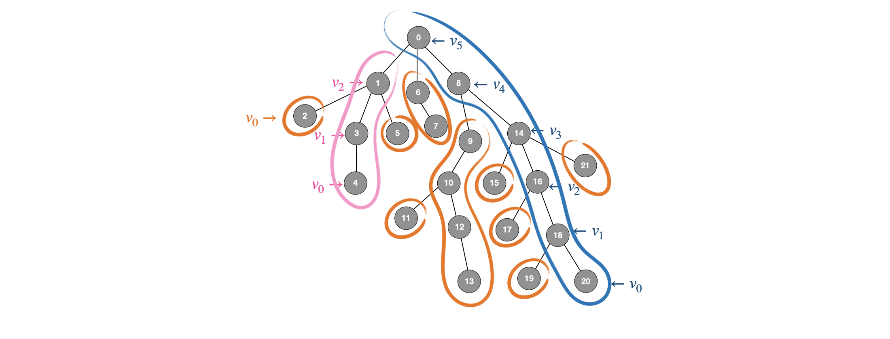
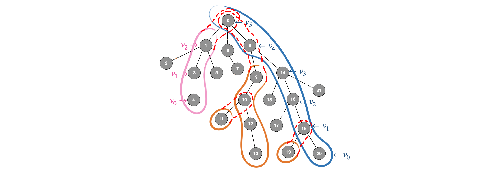

# Correctness and Complexity

## INTRODUCTION ##
Given a rooted tree <i>T = (V, p, r)</i>, a node <i>u</i> and an integer <i>k</i>, the goal is to find the <i>k-th</i> ancestor of node <i>u</i>:  

<i>LAT(u, k) = pk(u)</i>  

where <i>pn(u) = p(pn-1(u))</i> if <i>n > 0</i>  
and <i>p0(u) = u</i>  

The <i>Level Ancestor</i> problem is to preprocess a given rooted tree T to support level ancestor queries. Both the preprocessing time and the query time must be optimized.  

  

<i>T</i> can be preprocessed in time <i>O(n)</i> (where <i>n</i> is the number of nodes), to answer <i>LA</i> queries in time <i>O(1)</i>.  
If an algorithm has preprocessing time <i>f(n)</i> and query time <i>g(n)</i>, we will say that the algorithm has complexity <i>\<f(n), g(n)\></i>. Thus, the solution to the <i>LA</i> problem has complexity <i>\<O(n), O(1)\></i>.  
 The algorithm presented here is from the paper <i>"The LA Problem Simplified"</i> by <i>Michael Bender</i> and <i>Martin Farach-Colton</i> from the year 2003.  

## SOLUTION TO THE <i>LA</i> PROBLEM ##
### Table Solution ###
A simple algorithm is based on the observation that there are only <i>&Theta;(n2)</i> possible queries in a tree of size <i>n</i>. If we precompute all of them in a table, we can answer <i>LA</i> in <i>O(1)</i> time.

For every node <i>v &in; V</i> we have:  
<i>LAtable[v][0] = v</i>  
<i>LAtable[v][i + 1] = p(LAtable[v][i])</i> if <i>LAtable[v][i] &ne; NULL</i>  

Answering a query requires one simple table lookup.     
  * <i>O(n2)</i> processing time  
  * <i>O(1)</i> query time  

### Path Decomposition ###
To solve the <i>LA</i> problem we will decompose the tree into paths. To understand why this is advantageous let us consider a single path of the tree. Solving the <i>LA</i> problem on a single path of length <i>m</i> can be done by maintaining an array <i>Path[0...m-1]</i>, where the nodes of the path are stored in top-to-bottom order from root to leaf. Suppose node <i>u</i> is stored at position <i>i</i>, then to answer <i>LA(u, k)</i> (for <i>k &le; i</i>) we simply return  
<i>Path[i - k]</i>.  

Looking for an optimal solution, the tree must be decomposed into paths with maximal lengths. We will find a <i>long-path decomposition</i> of the tree <i>T</i> by greedily decomposing the tree into disjoint paths. At each step we find the longest root-leaf path in <i>T</i> and remove it from the tree. This removal breaks the tree into subtrees <i>T1 , T2</i> , .... Recursively split these subtrees by removing their longest root-leaf paths. Each removed path is stored as an array in top-to-bottom path order (from root to leaf).  

To find a long-path decomposition of the tree <i>T</i> in linear time we use the following procedure:  
  1. Compute the depths of the nodes of the tree. This can be done in <i>O(n)</i> time using simple breadth-first traversal.  
  2. Build a list of the leaves of the tree sorted by depths in descending order <i>L = [l0 , l1 , ..., lk]</i>. This can be done in <i>O(n)</i> time using bucket sort.  
  3. Iteratively build longest path arrays starting with each of the leaves:  
        3.1. Starting at leaf <i>li</i> traverse the tree upwards  
        3.2. Mark every visited node  
        3.3. Add every visited node to the path array  
        3.4. Stop when reaching a node that is already marked, or when reaching the root  
  4. Store the path arrays in an array of arrays <i>Paths</i>  
  5. For every node store the number of the path array to which it belongs:  
        <i>path(v) = i &rarr; v &in; Pathsi</i>  
  6. For every node store the position at which it occurs in the path array:  
        <i>ind(v) = j &rarr; Pathspath(v)[j] = v</i>  

To answer level ancestor queries we move upwards jumping from path to path:  
<i>LA(v, k) = Pathspath(v)[ind(v) - k]</i> if <i>k &le; ind(v)</i>  
<i>LA(v, k) = LA(p(Pathspath(v)[0]), k - ind(v) - 1)</i>, otherwise  

The complexity of this procedure depends on the number of paths we traverse. Given a node <i>v</i>, let <i>u = p(Pathspath(v)[0])</i>. Then we have the following:  
<i>|Pathspath(v)| + 1 &le; |Pathspath(u)|</i>  
Since we used greedy decomposition the node <i>u</i> must belong to a longer path than the node <i>v</i>.  

Let <i>v0 = v</i>, 
<i>v1 = p(Pathsv0[0])</i>, 
<i>v2 = p(Pathsv1[0])</i>, ..., 
vk be the nodes for which the querying procedure has been recursively called. Then we have the following:  
  * <i>Pathspath(vi) &cap; Pathspath(vj) = &empty;</i>  
  * <i>Pathspath(vi) + 1 &le; Pathspath(vi + 1)</i>  
  * <i>&Sum;0 &le; i &le; k |Pathspath(vi)| &le; n</i>  

<i>Pathspath(vi) + 1 &le; Pathspath(vi + 1)</i>  
<i>&rarr; Pathspath(v0) + i &le; Pathspath(vi)</i>  
<i>&rarr; &Sum; |Pathspath(vi)| &ge; &Sum; (|Pathspath(v0)| + i) &ge; &Sum; i</i>  
<i>&rarr; &Sum;0 &le; i &le; k i &le; n</i>  

In the worst case the "&le;" sign is an "=" sign and we have that querying can be done in <i>O(&radic;n)</i> time.  
  * <i>O(n)</i> processing time  
  * <i>O(&radic;n)</i> query time  

  

### Ladder Algorithm ###
For the path decomposition we had the following relation:  
<i>Pathspath(vi) + 1 &le; Pathspath(vi + 1)</i>  

With this relation we achieved <i>O(&radic;n)</i> query time. To achieve <i>O(log n)</i> query time we must have the following relation:  
<i>Pathspath(vi) * 2 &le; Pathspath(vi + 1)</i>  

Then:  
<i>Pathspath(v0) * 2i &le; Pathspath(vi)</i>  
<i>&Sum; |Pathspath(vi)| &ge; &Sum; (|Pathspath(v0)| * 2i) &ge; &Sum;0 &le; i &le; k 2i</i>  

And we have <i>k &in; O(log n)</i>  

For this reason we extend the long paths into <i>Ladders</i>: for every path <i>Pathsi</i> we build a ladder <i>Laddersi</i> by doubling the path. Each path is extended upward by adding the immediate ancestors at the top of the path to the array. Extending the paths into ladders naively requires <i>O(n)</i> time.  

Again for every node we store the following information:   
  * <i>path(v) = i &rarr; v &in; Laddersi</i>  
  * <i>ind(v) = j &rarr; Ladderspath(v)[j] = v</i>  

We could again answer level ancestor queries by jumping from ladder to ladder. However, for every node <i>v</i> we could store in a sparse table every <i>2l -th</i> ancestor of that node. Then, to answer the level ancestor query <i>LA(v, k)</i>, we compute <i>d</i> and <i>l</i> such that:  
<i>k = 2l + d</i>  
<i> 0 &le; d < 2l</i>  
Let <i>u = p2l(v)</i>, then <i>pk(v) = pd(u)</i>. Thus, we have:  
<i>LA(v, k) = Ladderpath(u)[ind(u) - d]</i>

To see why this is the case let <i>hv = height(v)</i> be the number of nodes in the longest downward path from node <i>v</i> to a leaf. Node <i>v</i> belongs to path <i>Pathspath(v)</i>. Since this path was build greedily it has at least <i>hv</i> nodes. Thus, the array <i>Ladderpath(v)</i> has at least <i>2 * hv</i> elements, and also this array contains at least <i>hv</i> ancestors of <i>v</i>. Now, since node <i>u = p2l(v)</i>, then <i>hu = height(u) &ge; 2l</i>. Also <i>Ladderpath(u)</i> contains at least <i>hu</i> ancestors of node <i>u</i>, and in particular it contains <i>pd(u)</i>.  

What is more, instead of storing a sparse table for every node, we could store a sparse table only for the leaves of the tree. To answer level ancestor queries we must also store a pointer from every node to one of its sub-leaves.  
Let <i>lv = leaf(v)</i> be the leaf to which node <i>v</i> points. Then:  
<i>LA(v, k) = LA(lv, k + depth(lv) - depth(v))</i>  

The sparse table has <i>O(Llog n)</i> entries, where <i>L</i> is the number of leaves. To build the table in <i>O(Llog n)</i> time we will build it bottom up. For every leaf <i>v</i> do the following:  
  1. Allocate an array <i>pv[0, 1, ..., logn]</i>  
  2. Initialize <i>pv[0] = v</i>  
  3. The <i>2l + 1</i> level ancestor of <i>v</i> is stored in the ladder of the <i>2l</i> level ancestor of <i>v</i>  
        <i>p2l + 1(v) = p2l(p2l(v))</i>  
        <i>u = pv[l]</i>  
        <i>d = 2l - 1</i>  
        <i>pv[l + 1] = p(Ladderspath(u)[ind(u) - d])</i>  

  * <i>O(n + Llog n)</i> processing time  
  * <i>O(1)</i> query time  

 

### The Macro-Micro-Tree Algorithm ###
The bottleneck in the previous algorithm is computing the sparse table. It takes <i>O(Llog n)</i> time. To achieve linear boundary of the algorithm the tree must have <i>O(n / log n)</i> leaves.  

To speed up the algorithm we will use a <i>micro-macro division</i> of the tree. A micro-macro divison partitions the nodes of a tree into a <i>macro</i> tree and <i>micro</i> trees, where each micro tree is a connected subtree of the original tree.

<!-- insert pic -->

Let <i>T = (V, p r)</i> be a rooted tree and let <i>B &in; &#8469;</i>. Let us consider a micro-macro division of <i>T</i> such that all micro trees contain at most <i>B</i> nodes:  
  1. A <i>micro node</i> is any node <i>v</i> such that <i>hv &le; B</i>.  
  2. A <i>macro node</i> is any node <i>v</i> such that <i>hv  > B</i>.  
  3. A <i>micro tree</i> is a subtree <i>Tv</i> rooted at node <i>v</i> such that:  
      <i>|Tv| &le; B</i>  
      <i>p(v)</i> is a macro node  
  4. <i>Macro leaves</i> are the leaves of the macro tree <i>Tmacro</i>.  

Considering this micro-macro division of <i>T</i> we can easily show that the number of macro leaves is at most <i>n / B</i>, where <i>n</i> is the number of nodes in <i>T</i>. Since every macro leaf <i>l</i> is a macro node we have that <i>|Tl| > B</i>. Also, for every two macro leaves <i>li</i> and <i>lj</i> we have that <i>Tli &cap; Tli = &empty;</i>. Then:  

<i>kB &le; &sum; |Tli| = |&cup; Lli| &le; n</i>  
<i>k &le; n / b</i>  
