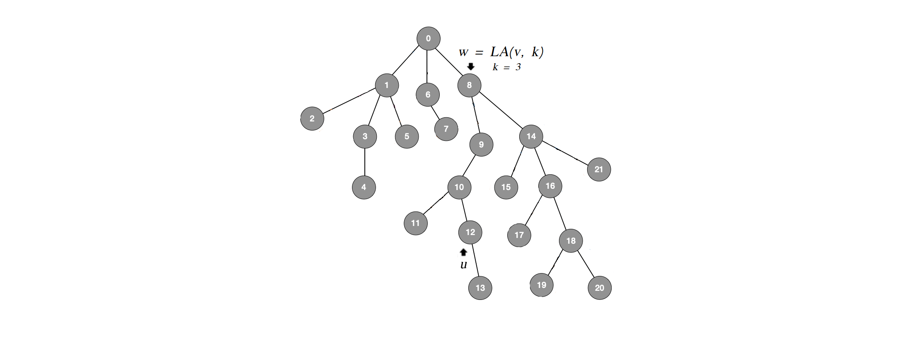

# Correctness and Complexity

## INTRODUCTION ##
Given a rooted tree <i>T = (V, p, r)</i>, a node <i>u</i> and an integer <i>k</i>, the goal is to find the <i>k-th</i> ancestor of node <i>u</i>:  

<i>LAT(u, k) = pk(u)</i>  

where <i>pn(u) = p(pn-1(u))</i> if <i>n > 0</i>  
and <i>p0(u) = u</i>  

The <i>Level Ancestor</i> problem is to preprocess a given rooted tree T to support level ancestor queries. Both the preprocessing time and the query time must be optimized.  

  

<i>T</i> can be preprocessed in time <i>O(n)</i> (where <i>n</i> is the number of nodes), to answer <i>LA</i> queries in time <i>O(1)</i>.  
If an algorithm has preprocessing time <i>f(n)</i> and query time <i>g(n)</i>, we will say that the algorithm has complexity <i>\<f(n), g(n)\></i>. Thus, the solution to the <i>LA</i> problem has complexity <i>\<O(n), O(1)\></i>.  
 The algorithm presented here is from the paper <i>"The LA Problem Simplified"</i> by <i>Michael Bender</i> and <i>Martin Farach-Colton</i> from the year 2003.  

## SOLUTION TO THE <i>LA</i> PROBLEM ##
### Table Solution ###
A simple algorithm is based on the observation that there are only <i>&Theta;(n2)</i> possible queries in a tree of size <i>n</i>. If we precompute all of them in a table, we can answer <i>LA</i> in <i>O(1)</i> time.

For every node <i>v &in; V</i> we have:  
<i>LAtable[v][0] = v</i>  
<i>LAtable[v][i + 1] = p(LAtable[v][i])</i> if <i>LAtable[v][i] &ne; NULL</i>  

Answering a query requires one simple table lookup.     
  * <i>O(n2)</i> processing time  
  * <i>O(1)</i> query time  

### Path Decomposition ###
To solve the <i>LA</i> problem we will decompose the tree into paths. To understand why this is advantageous, let us consider a single path of the tree. Solving the <i>LA</i> problem on a single path of length <i>m</i> can be done by maintaining an array <i>Path[0...m-1]</i>, where the nodes of the path are stored in top-to-bottom order from root to leaf. Suppose node <i>u</i> is stored at position <i>i</i>, then to answer <i>LA(u, k)</i> (for <i>k &le; i</i>) we simply return <i>Path[i - k]</i>.  

Looking for an optimal solution, the tree must be decomposed into paths with maximal lengths. We will find a <i>long-path decomposition</i> of the tree <i>T</i> by greedily decomposing the tree into disjoint paths. At each step we find the longest root-leaf path in <i>T</i> and remove it from the tree. This removal breaks the tree into subtrees <i>T1 , T2 , .... Recursively split these subtrees by removing their longest root-leaf paths. Each removed path is stored as an array in bottom-up path order (from leaf to root).  

To find a long-path decomposition of the tree <i>T</i> in linear time we use the following procedure:  
  1. Compute the depths of the nodes of the tree. This can be done in <i>O(n)</i> time using simple breadth-first traversal.  
  2. Build a list of the leaves of the tree sorted by depths in descending order <i>L = [l0 , l1 , ..., lk]</i>. This can be done in <i>O(n)</i> time using bucket sort.  
  3. Iteratively build longest path arrays starting with each of the leaves:  
  		3.1. Starting at leaf <i>li</i> traverse the tree upwards  
  		3.2. Mark every visited node  
  		3.3. Add every visited node to the path array  
  		3.4. Stop when reaching a node that is already marked, or when reaching the root  
  4. Store the path arrays in an array of arrays <i>Paths</i>  
  5. For every node store the number of the path array to which it belongs:  
  		<i>path(v) = i &rarr; v &in; Pathsi</i>  
  6. For every node store the position at which it occurs in the path array:  
  		<i>ind(v) = j &rarr; Pathspath(v)[j] = v</i>  

To answer level ancestor queries we move upwards jumping from path to path:  
<i>LA(v, k) = Pathspath(v)[ind(v) - k]</i> if <i>k &le; ind(v)</i>  
<i>LA(v, k) = LA(p(Pathspath(v)[0]), k - ind(v) - 1)</i>, otherwise  

The complexity of this procedure depends on the number of paths we traverse. Given a node <i>v</i>, let <i>u = p(Pathspath(v)[0])</i>. Then we have the following:  
<i>|Pathspath(v)| + 1 &le; |Pathspath(u)|</i>  
Since we used greedy decomposition the node <i>u</i> must belong to a longer path than the node <i>v</i>.  

Let <i>v0 = v<i>, 
<i>v1 = p(Pathsv0[0])</i>, 
<i>v2 = p(Pathsv1[0])</i>, ..., 
vk be the nodes for which the querying procedure has been recursively called. Then we have the following:  
  * <i>Pathspath(vi) &cup; Pathspath(vj) = &empty;</i>  
  * <i>Pathspath(vi) + 1 &le; Pathspath(vi + 1)</i>  
  * <i>&Sum;0 &le; i &le; k |Pathspath(vi)| = n</i>  

<i>
Pathspath(vi) + 1 &le; Pathspath(vi + 1)  
&rarr; Pathspath(v0) + i &le; Pathspath(vi)  
&rarr; &Sum; |Pathspath(vi)| &ge; &Sum; (|Pathspath(v0)| + i) &ge; &Sum; i  
&rarr; &Sum;0 &le; i &le; k &le; n  
</i>

In the worst case the "&le;" sign is an "=" sign and we have that querying can be done in <i>O(&sqrt;n)</i> time.  
  * <i>O(n)</i> processing time  
  * <i>O(&sqrt;n)</i> query time  

  

